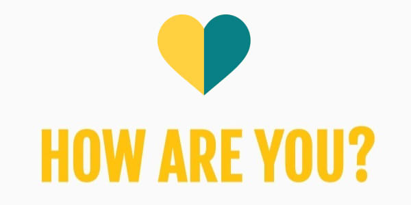
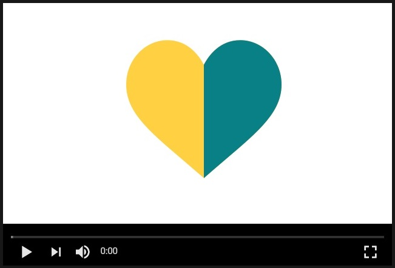
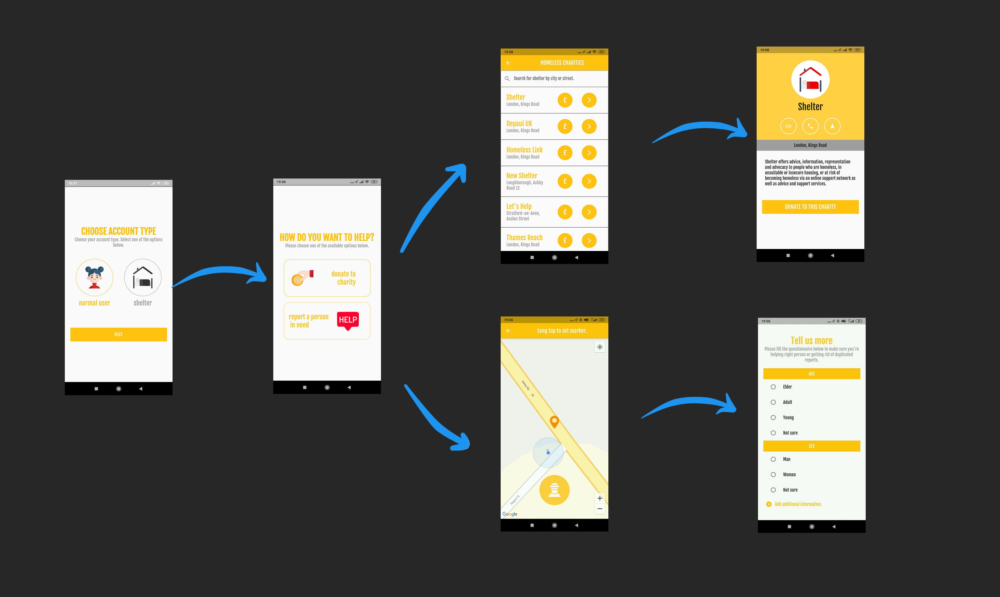
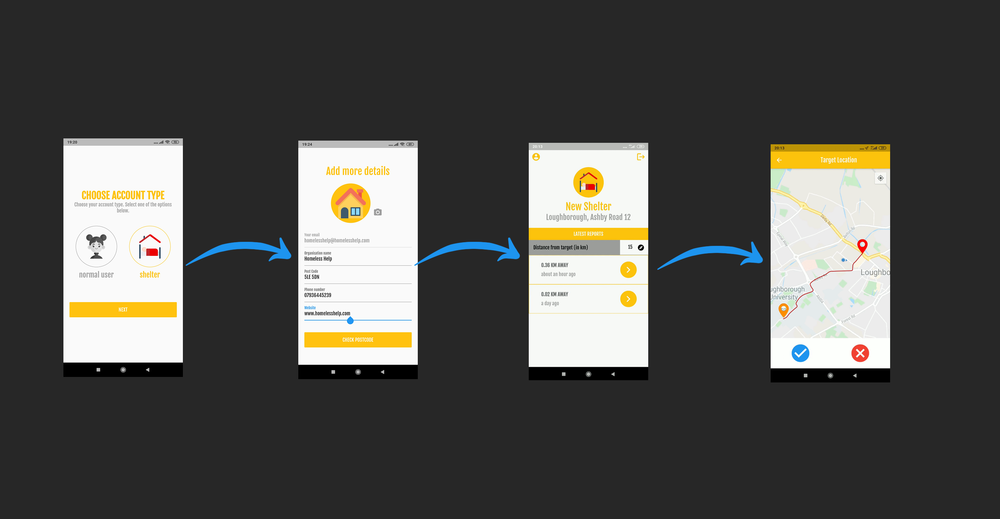

<p align="center">
  <a href="https://github.com/weronikazak/GSCProject">
    
  </a>

  <p align="center">
    An app to connect homeless shelters with people in need.
    <br />
    <br />
    <strong>Developed by:</strong>
    <br />
    <a href="https://github.com/weronikazak">Weronika Zak</a>
    ·
    <a href="https://github.com/JamesBlenkinsopp">James Blenkinsopp</a>
    ·
    <a href="https://github.com/0bex0">Becca Wye</a>
  </p>
</p>

  <p align="center">
  
  -
  
  -
  
  </p>
  
  
## About the app

<i>Homeless people are everywhere, but they are often treated as a negative by the community. They are told to hide away by the same community that should be helping them, and that’s why for this year’s contest, we have developed an app to support these people.</i>

To create a decent app, we contacted local shelters in Leicestershire and used their comments to improve our app so that it could be used as a genuine product rather than just software for a contest. However, we also paid attention to those who are willing to assist - the volunteers.

Although the shelters and people who shared their stories preferred to remain anonymous, we are appreciative for their assistance and support.

To get a broader idea of what drives us - check out the video below. James explains the idea behind our app in great detail!


<!-- [](https://youtu.be/CHnwr4HSWAg "Description") -->

<p align="center">
     <a src="https://youtu.be/CHnwr4HSWAg" target="_blank" width="450">  </a>
  <br>
  <a href="https://youtu.be/CHnwr4HSWAg">Click Me!</a> 
</p>


## How to run the app?
### The best way.

Install the app from <a href="https://play.google.com/store/apps/details?id=com.gsc.how_are_you" target="_blank">Play Store</a>:

<p align="center">
     <a src="https://play.google.com/store/apps/details?id=com.gsc.how_are_you" target="_blank" width="150"> 
        
     </a>
  <br>
  <a href="https://play.google.com/store/apps/details?id=com.gsc.how_are_you">Click Me!</a> 
</p>


<b><i> IN CASE THE LINK WAS NOT FOUND (THE APP MIGHT BE STILL TESTED BY GOOGLE PLAY), PROCEED TO THE STEP BELOW </i></b>


### Another good alternative.

1. Open the terminal and clone the repo.

```
git clone https://github.com/weronikazak/GSC_Project.git
```

2. Transfer the `HowAreYou.apk` from the "APK" folder in repo to your phone.

3. Navigate to the folder you placed the APK in and install it.


### Last but not least.

1. Please make sure you have flutter installed. If you do not, follow the steps from <a href="https://flutter.dev/docs/get-started/install" target="_blank">here</a>.

2. Open the terminal and clone the repo.

```
git clone https://github.com/weronikazak/GSC_Project.git
```

3. Enable the developer mode on your phone and connect it to your computer with the USB cable.

4. Once you clone the repository, type in your terminal:

```
cd GSC_Project
flutter install
```

## After installation

The app works differently depending on who the user is: a Shelter or a Passer-by.

### The app for a Passer-by

1. **Register using your Phone Number**
 
We chose to enable registration to reduce the risk of a bogus call or spam assault. We are aware, however, of the arduous nature of the regestration procedure. That's why we put speed first: simply pressing a button, your phone number is entered and you can use the app.

2. **Donate to Shelter**

The user has the option of donating to a local shelter or charity. More information about the avenue, including its website, phone number, and location, may be found here.

3.  **Report a Homeless Person**

The main feature though allows to report a person in need. Marking the position of a homeless person is as simple as pressing a point on the integrated map of one's present location and filling out a short survey to describe their appearance so the app may cross-reference it with other descriptions from the same area.

<p align="center">
    
</p>

### The app for Shelters

1. **Register using your Email**
 
The process of registering a shelter will require email verification as well as the phone number used to register. This is to ensure that the potentially sensitive information is only sent to legitimate homeless shelters.

2. **Provide Details**

In the next stage you will be asked to provide information about your shelter, including the address, website, and a brief description. The data will be saved in a database and made available to all users.

3.  **Browse Reports**

You'll see the most recent reports in your chosen proximity after logging in (by default: 10 km). You can look through them and get a quick overview of what they're about. The reports are classified by the time they were sent and by the number of times a similar report was sent by various users.

4.  **Accept or Reject the Report**

After you click on report details a map will appear, showing the route between your current position and the probable homeless person's location. If you choose not to approve the report, it will be removed from your report list. Otherwise you will be routed to the place.

<p align="center">
        
</p>
